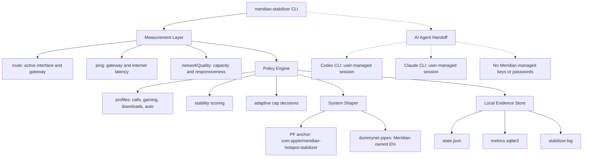

# Meridian Hotspot Stabilizer

> Speed tests flatter bad links. Calls expose them.

Meridian Hotspot Stabilizer is a macOS CLI for turning an unstable phone hotspot into a more predictable working link. It watches the real path your Mac is using, measures latency and queue pressure, and applies conservative PF/dummynet shaping before the hotspot turns upload bursts into seconds of lag.

It is not a booster. It is not a carrier hack. It is not a fake dashboard wrapped around optimistic numbers. Meridian is a local control system for the part of the network your Mac can actually influence.

```text
Goal: fewer freezes, lower jitter, cleaner calls, safer recovery.
Trade: give up some peak throughput to protect responsiveness.
Rule: if Meridian cannot measure a value, it says unavailable.
```

## The Idea

Most hotspot problems are not raw speed problems. They are queueing problems.

A cellular link can show hundreds of Mbps in a test and still make a meeting unusable when a sync client, browser upload, or background process fills the upstream queue. Once that queue is full, every packet waits behind it: audio, video, DNS, SSH, remote desktop, everything.

Meridian keeps the Mac below that cliff. It measures the link, chooses caps with profile-specific headroom, watches jitter and loss, and adjusts gradually. The product is built around one operational belief:

> A stable 25 Mbps link often beats an unstable 300 Mbps link.

## Product Shape

Meridian is CLI-first on purpose.

There is no web app to secure, no synthetic demo environment, and no pretend telemetry. The CLI is the product surface, the operator console, the service entrypoint, and the diagnostic tool.

| Layer | Responsibility |
| --- | --- |
| CLI | Operator commands, dashboard, reports, service entrypoint. |
| Measurement | `route`, `ping`, `networkQuality`, live interface and gateway detection. |
| Policy | Profiles, stability score, cap selection, adaptive tuning. |
| Shaper | PF anchor and dummynet pipes owned only by Meridian. |
| State | JSON state, SQLite metrics/events, local logs. |
| Agent Layer | Local AI-operator handoff that exports real Meridian context without storing provider credentials. |

## Architecture



## Trust Contract

Meridian should be boring where network software must be boring.

| Contract | Implementation |
| --- | --- |
| No fake data | Dashboard, reports, events, and recommendations use live local measurements or prior real local samples. |
| No silent global edits | Meridian does not edit `/etc/pf.conf`. |
| Narrow ownership | Rules are loaded into `com.apple/meridian-hotspot-stabilizer`; cleanup targets Meridian-owned pipes and anchor state. |
| Read-only inspection | `preflight`, `doctor`, `profiles`, `dashboard`, `events`, and `report` do not apply shaping rules. |
| Explicit privilege | Shaping, stopping, service install, and service uninstall use privileged system commands only when required. |
| Clear failure | Missing metrics are printed as `unavailable`; they are not guessed. |
| Emergency rollback | `panic` clears owned PF/dnctl state and marks Meridian inactive. |
| Account safety | AI integrations use provider-managed local sessions; Meridian does not log in, store keys, or store passwords. |

Current boundary: this repository is a production-grade CLI foundation. It is not yet a signed macOS package with a signed privileged helper. Privileged shaping is currently sudo-backed.

## AI Operator Handoff

Meridian can work beside AI coding/operator tools without becoming a secret store or an unbounded remote-control plane.

The `agents` command detects supported local provider CLIs and exports a real Meridian context bundle. That bundle contains current state, recent real samples, recent events, safety boundaries, and optional live measurements.

Meridian does not authenticate to providers. Users authenticate with the provider's own official tooling, then Meridian can hand off context to that already-managed local session.

Supported provider targets:

- Codex CLI session, managed outside Meridian
- Claude CLI session, managed outside Meridian
- no Meridian-managed API keys
- no API keys in Meridian config
- no provider passwords in files, logs, SQLite, or git

Check local AI readiness:

```sh
python3 -m meridian_stabilizer agents
```

Export a real context bundle for an AI operator:

```sh
python3 -m meridian_stabilizer agents --context
```

Export machine-readable context:

```sh
python3 -m meridian_stabilizer agents --context --json
```

Agent work stays bounded:

| Agent ability | Boundary |
| --- | --- |
| Read diagnostics | Allowed from local real-data state, logs, and metrics. |
| Explain decisions | Allowed, but explanations must cite measured fields or stored events. |
| Recommend commands | Allowed as text unless the user explicitly runs the command. |
| Apply shaping | Must go through existing `start`, `tune`, `stop`, or `panic` paths. |
| Store secrets | Not allowed. |

## Install

Requirements:

- macOS
- Python 3.11+
- Built-in macOS commands: `route`, `ping`, `networkQuality`, `pfctl`, `dnctl`, `launchctl`

Run from the repository root:

```sh
python3 -m meridian_stabilizer --help
```

Optional editable install:

```sh
python3 -m pip install -e .
meridian-stabilizer --help
```

## First Run

Start with inspection. This does not shape traffic.

```sh
python3 -m meridian_stabilizer preflight
python3 -m meridian_stabilizer doctor --profile calls
```

Then start shaping.

```sh
python3 -m meridian_stabilizer start --profile calls
```

For an adaptive foreground session:

```sh
python3 -m meridian_stabilizer run --profile calls
```

For a real terminal dashboard:

```sh
python3 -m meridian_stabilizer dashboard
```

Stop cleanly:

```sh
python3 -m meridian_stabilizer stop
```

Emergency stop:

```sh
python3 -m meridian_stabilizer panic
```

## Operator Commands

| Command | Why it exists |
| --- | --- |
| `preflight` | Proves the machine can run Meridian before shaping anything. |
| `doctor` | Measures the current link and explains what Meridian can use. |
| `profiles` | Shows the tuning posture for calls, gaming, downloads, and auto mode. |
| `start` | Applies the current profile once. |
| `run` | Applies shaping and keeps tuning in the foreground. |
| `dashboard` | Live terminal view backed by real measurements. |
| `tune` | Takes a fresh measurement and updates active caps. |
| `status` | Reads local state and optionally system PF/dnctl state. |
| `events` | Shows stored operational events. |
| `report` | Produces a real-data local diagnostic report. |
| `agents` | Detects local AI provider CLIs or exports real Meridian context for a user-managed AI session. |
| `stop` | Removes Meridian-owned shaping. |
| `panic` | Fast rollback path for owned shaping and local active state. |
| `install-service` | Installs the launchd-backed CLI watcher. |
| `uninstall-service` | Removes the launchd service. |

## Profiles

Profiles are not themes. They encode the product's tuning posture.

| Profile | Bias |
| --- | --- |
| `calls` | Protect video calls and work apps from upload-driven latency spikes. |
| `gaming` | Favor very low jitter and quick recovery over raw throughput. |
| `downloads` | Preserve bulk throughput while limiting severe bufferbloat. |
| `auto` | Balanced mode for mixed browsing, calls, and downloads. |

Inspect exact thresholds:

```sh
python3 -m meridian_stabilizer profiles
```

## Real-Data Dashboard

The dashboard is intentionally terminal-native. It is built for operators, not screenshots.

```sh
python3 -m meridian_stabilizer dashboard
```

It can show only what was actually measured:

- active profile and shaping state
- active interface and gateway
- upload/download caps
- gateway latency and jitter
- internet latency, jitter, max spike, and loss
- `networkQuality` capacity and responsiveness when requested
- recent local events
- stability score derived from measured latency, jitter, loss, and responsiveness

Render one sample:

```sh
python3 -m meridian_stabilizer dashboard --once
```

Ask for periodic capacity measurement:

```sh
python3 -m meridian_stabilizer dashboard --quality-every 300
```

## Evidence Store

Meridian writes local evidence here:

```text
~/.meridian-hotspot-stabilizer/
```

| File | Purpose |
| --- | --- |
| `state.json` | Active profile, interface, gateway, caps, PF token, watcher heartbeat. |
| `metrics.sqlite3` | Real samples and operational events. |
| `stabilizer.log` | Local operational logs. |
| `service.out.log` | launchd stdout when service mode is installed. |
| `service.err.log` | launchd stderr when service mode is installed. |

This codebase does not send metrics to a server. The current product is local-only.

## Background Mode

Install the launchd-backed watcher:

```sh
python3 -m meridian_stabilizer install-service --profile calls --interval 60
```

Remove it:

```sh
python3 -m meridian_stabilizer uninstall-service
```

The service runs the same CLI engine as `run`. It records real samples and events into SQLite and uses the same owned PF/dnctl cleanup path.

## Production Operations

Dry-run the exact shaping commands:

```sh
python3 -m meridian_stabilizer start --profile calls --dry-run
```

Start with manual caps:

```sh
python3 -m meridian_stabilizer start --profile calls --upload-mbps 8 --download-mbps 25
```

Inspect system shaper state:

```sh
python3 -m meridian_stabilizer status --system
```

Export a machine-readable report:

```sh
python3 -m meridian_stabilizer report --json
```

## Development

Run tests:

```sh
PYTHONDONTWRITEBYTECODE=1 python3 -m unittest discover -s tests
```

Compile-check:

```sh
PYTHONDONTWRITEBYTECODE=1 python3 -m compileall -q -x '(^|/)\._' meridian_stabilizer tests
```

Run a syntax-only shaper dry run:

```sh
PYTHONDONTWRITEBYTECODE=1 python3 -m meridian_stabilizer start --profile calls --dry-run
```

## What Is Not Done Yet

The next production milestones are intentionally unglamorous:

- local AI agent handoff with Codex and Claude user-managed session support
- signed macOS `.pkg` installer
- signed privileged helper instead of sudo-backed operations
- stricter launchd lifecycle supervision
- diagnostic bundle generation
- release artifacts and reproducible builds
- deeper per-application traffic awareness where macOS exposes reliable signals

Meridian's standard is simple: real measurements, narrow system ownership, explicit rollback, no invented data.
